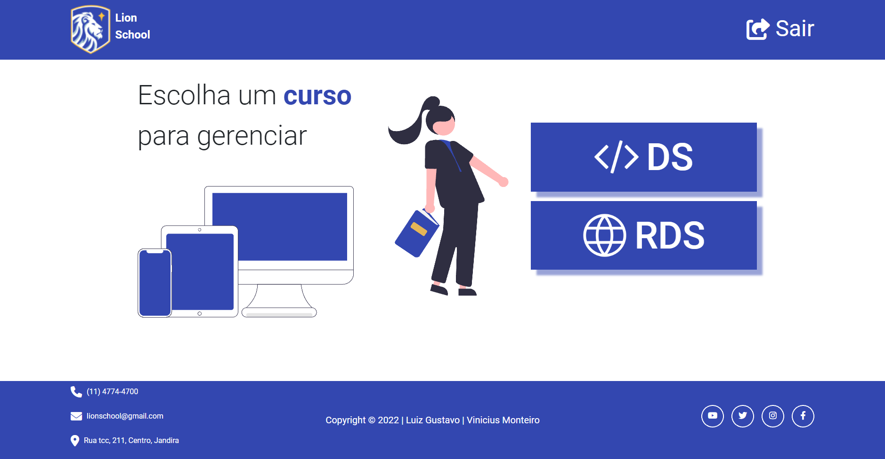

# lion-school

## Sobre o Projeto

A atividade tem como objetivo integrar as disciplinas de PWFE (Programação web Front-end) e PWBE (Programação web Back-end) do curso de desenvolvimento de sistemas do SENAI Jandira. O projeto é o gerenciamento da escola Lion School, deverá ser realizado tanto o back-end como o front-end.

- [Link do site](https://projeto-lion-school-2023-front.vercel.app)

 

## Tecnologias utilizadas

- Javascript
- HTML
- CSS
- Node.js
- Figma
- Bootstrap

 

## Deploy

### Deploy Back-End (API)

Realizado com o [Cyclic](https://www.cyclic.sh/)

### Deploy Front-End

Realizado com o [Vercel](https://vercel.com/)

 

## Repositorios

### Confira também os repositorios:

[Back-End](https://github.com/Monteiro77/projeto-Lion-School-Ds2t-Back)

[Front-End](https://github.com/luyz-gusta/Projeto-Lion-School-2023-Front) - Você está aqui 🚩

[Figma](https://www.figma.com/file/kwoEZFnn7EbcrgrYMOsLlF/Projeto-Lion-School?node-id=0-1&t=Q5IUuvo0OnVCzXlH-0)

 

## Colaboradores

|                                                                                                             |                                                                                                                                                              |
| ----------------------------------------------------------------------------------------------------------- | ------------------------------------------------------------------------------------------------------------------------------------------------------------ |
|  |   |
|               |              |
